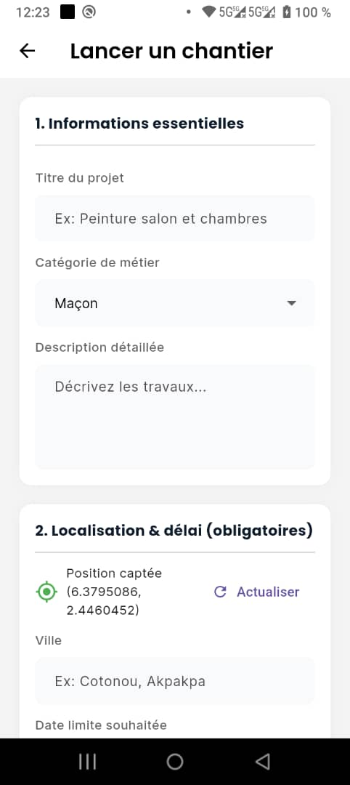

# 👋 Daniel — Digitalisation haute performance

Spécialiste de la **digitalisation haute performance**, j’accompagne des entrepreneurs ambitieux pour transformer des concepts bruts en **écosystèmes digitaux scalables**.

Mon approche est simple :  
**design à fort impact + robustesse technique extrême**.  
Chaque ligne de code est pensée pour la vitesse, chaque détail pour la conversion.

Basé au **Bénin**, j’opère à l’international pour des clients qui exigent des **résultats rapides et mesurables** (Standard **72H**).

---

## 🚀 Projet phare — SmileUp Platform

**SmileUp** est une plateforme digitale qui sécurise et organise les projets de construction et de rénovation en Afrique.

🎯 Objectif :  
> restaurer la **confiance** entre clients et artisans grâce à la technologie.

### 🔑 Problèmes résolus
- Chantiers abandonnés  
- Paiements non sécurisés  
- Manque de suivi et de transparence  

### ✅ Solution
- Paiements sécurisés (argent bloqué jusqu’à validation)
- Suivi du chantier étape par étape
- Protection **client + artisan**
- Écosystème structuré, simple, accessible

🌍 Site officiel :  
👉 https://smileupplatform.com/

---

## 📱 Applications mobiles SmileUp

### 👤 App Client

📲 Télécharger sur Google Play :  
👉 https://play.google.com/store/apps/details?id=com.smileupplatform.app

Fonctionnalités clés :
- Trouver des artisans vérifiés
- Suivre l’avancement du chantier
- Sécuriser les paiements
- Réduire les conflits

---

### 🛠️ App Artisan

📲 Télécharger sur Google Play :  
👉 https://play.google.com/store/apps/details?id=com.smileupplatform.artisan

Fonctionnalités clés :
- Gérer ses chantiers
- Être payé de façon sécurisée
- Gagner en crédibilité
- Travailler dans un cadre structuré

---

## 🧠 Stack & compétences

- **Frontend** : Flutter, UI/UX orienté conversion  
- **Backend** : Symfony, API REST, sécurité  
- **Mobile** : Flutter (Client / Artisan / Partenaire)  
- **Produit** : architecture scalable, process métier  
- **Vision** : exécution rapide, focus résultats

---

## ⏱️ Méthode de travail — Standard 72H

> Pas de blabla. Pas de promesses floues.

- Analyse rapide
- Décisions claires
- Exécution immédiate
- Livraison mesurable

---

## 🎥 Contenu & documentation publique

Je documente **en temps réel** :
- le code
- les décisions produit
- les défis business
- les erreurs et les itérations

📲 TikTok :  
👉 https://www.tiktok.com/@daniel.tech.studio  
*(si tu veux changer le handle, dis-le moi)*

---

## 📬 Contact

🌐 Site : https://smileupplatform.com  
💼 GitHub : https://github.com/harissonola  
📧 Email : contact@smileupplatform.com

---

> _« Je ne vends pas des idées.  
Je construis des systèmes qui fonctionnent. »_
